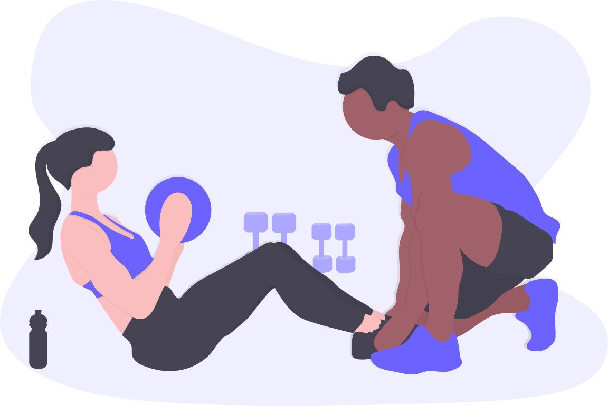

<!DOCTYPE html>
<html>

<head>
	<meta charset="UTF-8">
	<meta http-equiv="X-UA-Compatible" content="IE=edge">
	<meta name="viewport" content="width=device-width, initial-scale=1.0">

	<link rel="stylesheet" href="https://cdnjs.
	cloudflare.com/ajax/libs/font-awesome/4.7.0/
	css/font-awesome.min.css">
	<title>Healtybee</title>
	<link rel="stylesheet" href="style.css">
	
	
</head>

<body>
	

		<nav>
			<ul>
				<li><a href="#">Home</a></li>
				<li><a href="#check">Why US</a></li>
				<li><a href="#serv">Services</a></li>
				<li><a href="#icons">Follow ON</a></li>
			</ul>
		</nav>
		

			<h1>WELCOME TO HEALTHYBEE</h1>
			
Lorem ipsum is a placeholder text commonly
				used to  demonstrate the visual form of a
				document  or a typeface without relying.

			<button type="button" class="btn">Read More</button>
		

	

	

	

		

			
		

		

			<h1 id="newh1">WHY US?</h1>
			

				<button type="button" class="btn">What We Provide?</button>
				<button type="button" class="btn">FEE & Charges</button>
				<button type="button" class="btn">OUR Acheviments</button>
				<button type="button" class="btn">Faculties</button>
				<button type="button" class="btn">Checking</button>
				<h2></h2>

			

		

	

	

		<h1 id="heading">OUR Services</h1>
		
		
		
		
		

		

	

	

	

	HEALTHYBEE, Copyright &copy; 2021
		<ul id="icons">
			<li><a href="https://www.facebook.com">
					<i class="fa fa-facebook" aria-hidden="true"></i>
				</a></li>

			<li><a href="https://www.twitter.com">
					<i class="fa fa-twitter" aria-hidden="true"></i>
				</a></li>

			<li><a href="https://www.instagram.com">
					<i class="fa fa-instagram" aria-hidden="true"></i>
				</a></li>

			<li><a href="https://www.linkein.com">
					<i class="fa fa-linkedin" aria-hidden="true"></i>
				</a></li>
		</ul>
	

</body>
